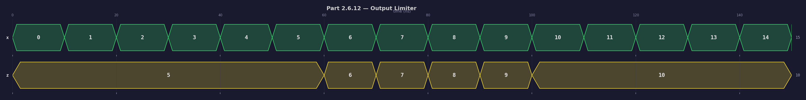
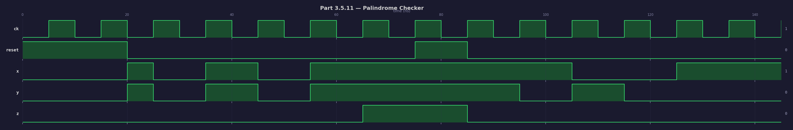
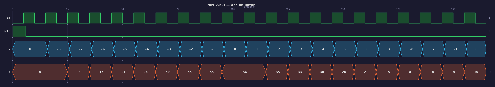

# Homework 1 -- Combined Submission Report

## File Manifest

| Problem | Design source | Testbench | Waveform |
|---------|--------------|-----------|----------|
| 2.6.12 Output Limiter | `output_limiter.vhd` | `tb_output_limiter.vhd` | `waveform_limiter.png` |
| 3.5.11 Palindrome Checker | `palindrome_synch_ckt.vhd` | `tb_palindrome_synch_ckt.vhd` | `waveform_palindrome.png` |
| 7.5.3 Accumulator IP | `accumulator_top.vhd` + `c_accum_0.vhd` | `tb_accumulator_top.vhd` | `waveform_accumulator.png` |

Simulation scripts: `run_all.sh` (master), `run_vcd_limiter.tcl`, `run_vcd_palindrome.tcl`, `run_vcd_accumulator.tcl`.

---

## Part 2.6.12 -- Upper and Lower Output Limiter

### Design Summary

A package `output_limiter` declares constant `n := 4`. The entity `user_logic` has generics `u` (upper limit) and `l` (lower limit), both `std_logic_vector(n-1 downto 0)`, with defaults of all-ones and all-zeros respectively.

The architecture is a purely combinational process:

- If `x < l` (unsigned comparison), output `z = l`.
- If `x > u` (unsigned comparison), output `z = u`.
- Otherwise, output `z = x` (pass-through).

### Testbench

`tb_output_limiter` instantiates `user_logic` with `u => "1010"` (decimal 10) and `l => "0101"` (decimal 5). It sweeps `x` through all 16 values (0..15), waiting 10 ns per value, and asserts the expected clamped output at every step.

### Simulation Waveform



### Correctness Discussion

The waveform confirms the limiter operates correctly across the full input range:

| x range | Expected z | Observed |
|---------|-----------|----------|
| 0--4 | 5 (lower limit) | z stays at 5 |
| 5--10 | x (pass-through) | z tracks x: 5,6,7,8,9,10 |
| 11--15 | 10 (upper limit) | z stays at 10 |

The simulation log reports `tb_output_limiter PASSED` with zero assertion errors, confirming functional correctness for every possible 4-bit input.

---

## Part 3.5.11 -- Sequential Palindrome Checker

### Design Summary

Entity `palindrome_synch_ckt` has generic `n := 5` and ports `x`, `y`, `ck`, `reset` (inputs) and `z` (output).

On each rising clock edge after reset is de-asserted, one bit from `x` and one bit from `y` are shifted into registers `x_shift` and `y_shift` (LSB-first). A counter tracks how many bits have been captured. After exactly `n` clock cycles, the circuit compares `x_shift` with `reverse_bits(y_shift)`. Output `z` is set to `'1'` if they match (i.e., the two sequences are palindromes of each other) and `'0'` otherwise. While `reset = '1'`, all registers and the output are cleared.

### Testbench

`tb_palindrome_synch_ckt` runs two back-to-back test cases with `n = 5`:

**Test 1 (palindrome match):**
- `x` sequence: 1, 0, 1, 0, 1
- `y` sequence: 1, 0, 1, 0, 1
- `reverse(y)` = 1, 0, 1, 0, 1 = `x`, so `z` should be `'1'`.

**Test 2 (no match):**
- `x` sequence: 1, 1, 0, 0, 1
- `y` sequence: 1, 0, 1, 0, 0
- `reverse(y)` = 0, 0, 1, 0, 1 ≠ `x`, so `z` should be `'0'`.

A reset pulse separates the two tests.

### Simulation Waveform



### Correctness Discussion

The waveform shows two distinct test windows separated by a reset pulse:

1. **First window (t ~ 20--70 ns):** After 5 clock cycles of input capture, `z` rises to `'1'` -- confirming the palindrome match between x = 10101 and reverse(y) = 10101.
2. **Second window (t ~ 80--130 ns):** After 5 more clock cycles with different inputs, `z` remains `'0'` -- confirming the non-palindrome case where x = 11001 and reverse(y) = 00101 differ.

The simulation log reports `tb_palindrome_synch_ckt PASSED` with zero assertion errors.

---

## Part 7.5.3 -- Accumulator IP and Test Bench

### Design Summary

The accumulator is structured as a two-level hierarchy:

1. **`accumulator_top`** -- a thin wrapper with ports `ck`, `sclr` (synchronous clear), `x` (4-bit signed input), and `q` (8-bit signed output). It instantiates the IP core.

2. **`c_accum_0`** -- the accumulator IP. Two implementations are provided:
   - **Primary (Vivado IP):** In a Vivado project, generate a `c_accum_0` Accumulator IP from the IP Catalog (4-bit signed input, 8-bit signed output, synchronous clear). The generated IP replaces this file.
   - **Behavioral stand-in (portable):** The included `c_accum_0.vhd` is a behavioral VHDL model with identical port names (`B`, `CLK`, `SCLR`, `Q`) and identical accumulation semantics. It can be used for simulation on any VHDL-2008 simulator without requiring Vivado IP generation.

On each rising clock edge:
- If `SCLR = '1'`, the accumulator resets to zero.
- Otherwise, the 4-bit signed input is sign-extended to 8 bits and added to the running sum.

### Testbench

`tb_accumulator_top` feeds a sequence of 20 signed 4-bit values:

```
-8, -7, -6, -5, -4, -3, -2, -1, 0, 1, 2, 3, 4, 5, 6, 7, -8, 7, -1, 6
```

The testbench first asserts that synchronous clear works (q = 0 after sclr pulse), then applies each input value and asserts that `q` equals the expected running sum after every clock cycle.

Expected running-sum trace:

| Sample | x | Running sum |
|--------|---|-------------|
| 0 | -8 | -8 |
| 1 | -7 | -15 |
| 2 | -6 | -21 |
| 3 | -5 | -26 |
| 4 | -4 | -30 |
| 5 | -3 | -33 |
| 6 | -2 | -35 |
| 7 | -1 | -36 |
| 8 | 0 | -36 |
| 9 | 1 | -35 |
| 10 | 2 | -33 |
| 11 | 3 | -30 |
| 12 | 4 | -26 |
| 13 | 5 | -21 |
| 14 | 6 | -15 |
| 15 | 7 | -8 |
| 16 | -8 | -16 |
| 17 | 7 | -9 |
| 18 | -1 | -10 |
| 19 | 6 | -4 |

### Simulation Waveform



### Correctness Discussion

The waveform confirms:

1. **Clear works:** After the `sclr` pulse at the start, `q` is zero.
2. **Accumulation is correct:** The `q` trace matches the expected running-sum table. It descends to -36 (samples 0--8, accumulating negative values), then rises back through zero-crossing territory as positive values are added (samples 9--15), and finally settles at -4 after the last four mixed-sign inputs.
3. **Signed arithmetic:** The accumulator correctly handles two's complement sign extension from 4 bits to 8 bits throughout the entire sequence.

The simulation log reports `tb_accumulator_top PASSED` with zero assertion errors across all 20 samples plus the clear check.

### IP Dual-Path Note

For submission on a Vivado-equipped machine, the Vivado IP Catalog `c_accum_0` core can be generated and will seamlessly replace the behavioral `c_accum_0.vhd`. The port interface (`B`, `CLK`, `SCLR`, `Q`) and behavior are identical. The behavioral stand-in is included for portable simulation without requiring IP generation.

---

## Reproducing the Simulations

From the `Homework 1` directory, with Xilinx XSim on PATH:

```bash
bash run_all.sh
```

This compiles all VHDL, elaborates all three designs, runs all three simulations with VCD capture, and generates the waveform PNGs. Individual parts can also be run separately using the per-part TCL scripts.
