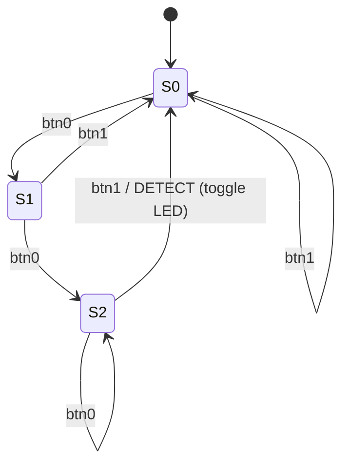

# Sequence Detector State Machine

Pattern to detect: **`btn0, btn0, btn1`** (in that order).

Out-of-sequence inputs follow KMP-style transitions: a `btn0` while
already at `S2` (`btn0,btn0` matched) is treated as a possible new
start of the pattern, so we stay at `S2` instead of falling all the way
back to `S0`.

On detection, the detection LED is **toggled** (off -> on -> off ...)
and the FSM resets to `S0` ready for the next match.

## State diagram

## Transition table

| Current state | Event  | Next state | Action                       |
|---------------|--------|------------|------------------------------|
| S0            | btn0   | S1         | -                            |
| S0            | btn1   | S0         | -                            |
| S1            | btn0   | S2         | -                            |
| S1            | btn1   | S0         | -                            |
| S2            | btn0   | S2         | KMP self-loop (new candidate)|
| S2            | btn1   | S0         | DETECTED -> toggle LED       |

## Why the KMP self-loop at S2

If the user presses `btn0, btn0, btn0, btn1`, a strict reset would
miss the match. The last two `btn0`s plus the trailing `btn1` still
form `btn0, btn0, btn1`. Holding at `S2` on an extra `btn0` consumes
the redundant prefix and the trailing `btn1` correctly fires
detection.

## Event source

A "press" is the **rising edge** of a button line (low -> high). The
software polls the AXI GPIO for buttons every ~5 ms and feeds one
event per detected edge into the FSM. If both buttons are sampled
high in the same scan, the event is ignored until at least one is
released, so simultaneous presses do not create ambiguous transitions.
