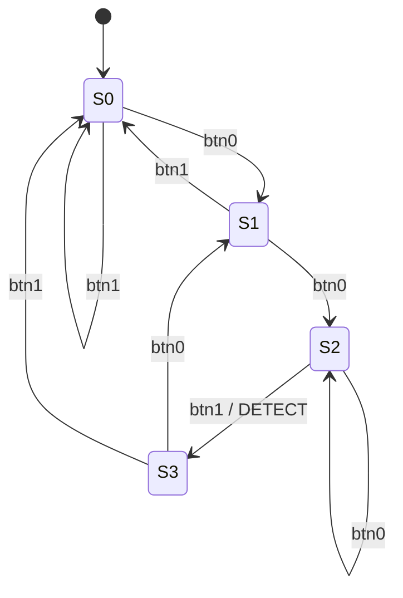

# Sequence Detector State Machine

Pattern to detect: **`BTN0, BTN0, BTN1`** (in that order).

This is a 4-state Moore-style FSM. The detection LED (`LD0_G` =
`rgb_leds_tri_o[1]`) is ON while, and only while, the FSM is in the
detected state `S3`. Out-of-sequence presses are handled with KMP-style
transitions so a redundant `BTN0` does not invalidate the prefix that
has already matched.

## State diagram

## Transition table

| Current state | Event | Next state | Action / LED                                        |
|---------------|-------|------------|-----------------------------------------------------|
| S0            | btn0  | S1         | LED OFF                                             |
| S0            | btn1  | S0         | LED OFF                                             |
| S1            | btn0  | S2         | LED OFF                                             |
| S1            | btn1  | S0         | LED OFF                                             |
| S2            | btn0  | S2         | KMP self-loop (the extra btn0 starts a new attempt) |
| S2            | btn1  | S3         | DETECTED -> LED ON                                  |
| S3            | btn0  | S1         | LED OFF (this btn0 may open the next match)         |
| S3            | btn1  | S0         | LED OFF                                             |

State meanings:

- `S0` - nothing matched yet
- `S1` - just saw `BTN0`
- `S2` - just saw `BTN0, BTN0`
- `S3` - just saw `BTN0, BTN0, BTN1` (detected; LED ON)

## Why the KMP transitions

- **`S2 + btn0 -> S2`**: the user pressed `BTN0, BTN0, BTN0`. The last
  two `BTN0`s are still a valid prefix of the pattern, so we stay at
  `S2` instead of falling to `S0` or `S1`. A trailing `BTN1` will then
  correctly fire detection.
- **`S3 + btn0 -> S1`**: as soon as we leave `S3`, the LED turns off,
  but the `BTN0` we just pressed could be the beginning of the next
  match — so we go to `S1` rather than `S0`.

## Event source

A "press" is the **rising edge** of a button line (low -> high). The
software polls the AXI GPIO for buttons every ~5 ms and feeds one
event per detected edge into the FSM. If both buttons are sampled
high in the same scan, the event is ignored until at least one is
released, so simultaneous presses never create ambiguous transitions.
