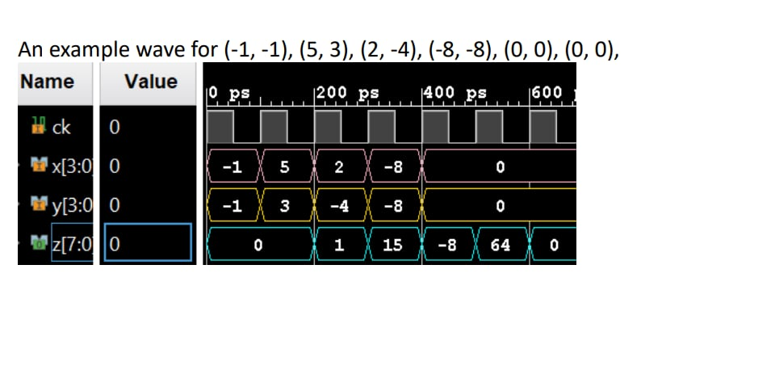

# Quiz 1 (practice) - IP Catalog Multiplier

**ECEC 402/661 Example Quiz (50 min)** - Simulate the Vivado IP-Catalog
Multiplier configured as:

- 4-bit signed inputs `x`, `y` (range `-8 .. 7`)
- 8-bit signed output `z` (range `-128 .. 127`)
- 2 pipeline stages (output latency = 2 `ck` cycles)

Deliverable: HDL code and a simulation snip showing correctness on the five
required test vectors plus the pipeline latency.

## Problem entity (verbatim from the hand-out)

```vhdl
library IEEE;
use IEEE.STD_LOGIC_1164.ALL;

library UNISIM;
use UNISIM.Vcomponents.all;

entity user_logic is
  Port (ck : IN STD_LOGIC;
    x, y : IN STD_LOGIC_VECTOR(3 DOWNTO 0);
    z : OUT STD_LOGIC_VECTOR(7 DOWNTO 0)  );
end user_logic;
```

Implemented in [rtl/user_logic.vhd](rtl/user_logic.vhd) as a thin wrapper that
instantiates `mult_gen_0`:

```vhdl
U_MULT : mult_gen_0
  port map (CLK => ck, A => x, B => y, P => z);
```

## Required test vectors

| # | x  | y  | expected z (signed) |
|---|----|----|---------------------|
| 0 | -8 |  7 | -56                 |
| 1 |  3 |  6 |  18                 |
| 2 | -1 |  3 |  -3                 |
| 3 | -4 |  5 | -20                 |
| 4 | -6 | -2 |  12                 |

The testbench also replays the example-wave vectors from the hand-out to
match the reference figure visually:

| # |  x |  y |  z |
|---|----|----|----|
| 5 | -1 | -1 |  1 |
| 6 |  5 |  3 | 15 |
| 7 |  2 | -4 | -8 |
| 8 | -8 | -8 | 64 |
| 9 |  0 |  0 |  0 |
|10 |  0 |  0 |  0 |

## IP Catalog configuration

See [docs/mult_gen_config.png](docs/mult_gen_config.png).

| Setting                         | Value                                   |
|---------------------------------|-----------------------------------------|
| Multiplier Type                 | Parallel Multiplier                     |
| Port A                          | Signed, Width 4                         |
| Port B                          | Signed, Width 4                         |
| Output Width                    | Full (MSB = 7, LSB = 0, 8 bits signed)  |
| Multiplier Construction         | Use LUTs                                |
| Optimization                    | Speed Optimized                         |
| Pipeline Stages                 | 2 (optimum = 2)                         |
| Clock Enable                    | disabled                                |
| Synchronous Clear               | disabled                                |

The Tcl side of this is automated in [scripts/setup.tcl](scripts/setup.tcl).

## Layout

```
Quiz_1/practice/
  rtl/user_logic.vhd          - entity + architecture wrapping mult_gen_0
  tb/tb_user_logic.vhd        - self-checking TB (VHDL-2008)
  scripts/setup.tcl           - generates mult_gen_0 and wires up sources
  docs/
    mult_gen_config.png       - IP Catalog screenshot from the hand-out
    example_wave.png          - reference wave from the hand-out
  README.md                   - this file
```

The Vivado project (`*.xpr`) and all generated artifacts (`.gen/`, `.cache/`,
`.sim/`, `.runs/`, `.ip_user_files/`, ...) are intentionally gitignored and
regenerated from `scripts/setup.tcl`.

## Set up the Vivado project

1. Open Vivado 2025.2 and create a new **RTL project** inside this folder:
   - **Project location**: `Quiz_1/practice/`
   - **Project name**: `quiz1_practice`
   - *Do not specify sources / constraints at this step - `setup.tcl` will
     add them.*
   - **Part**: `xc7z007sclg400-1` (Cora Z7-07S) - any Zynq/7-series part
     actually works since we only simulate.
2. In the Tcl console run:

   ```tcl
   cd [file dirname [get_property DIRECTORY [current_project]]]
   source scripts/setup.tcl
   ```

   That script:
   - generates `mult_gen_0` with the configuration listed above,
   - adds `rtl/user_logic.vhd` to **Design Sources** and
     `tb/tb_user_logic.vhd` to **Simulation Sources**,
   - sets file types (VHDL for RTL so the tool is happy, VHDL 2008 for the
     TB because it uses `std.textio.LF`),
   - sets the simulation top to `tb_user_logic` and the sources top to
     `user_logic`.

To regenerate the IP after tweaking configuration, set an env var before
sourcing:

```tcl
set ::env(QUIZ1_FORCE_IP) 1
source scripts/setup.tcl
```

## Manual Vivado setup (no Tcl - for quiz time)

Use this checklist when you need to reproduce the project purely by GUI
clicks (e.g. on the quiz machine where `scripts/setup.tcl` is not
available). Every step maps 1:1 to a line in `setup.tcl`.

### A. Create the project

1. **File -> Project -> New -> Next**.
2. **Project name**: `quiz1_practice`. **Project location**: wherever
   you are storing your quiz answer. **Next**.
3. **RTL Project**, check **Do not specify sources at this time**. **Next**.
4. **Parts** tab -> type `xc7z007sclg400-1` (Cora Z7-07S). Any 7-series
   / Zynq part also works since we only simulate. **Next -> Finish**.

### B. Generate `mult_gen_0` from the IP Catalog

1. **Flow Navigator -> Project Manager -> IP Catalog**.
2. In the search box type `multiplier`. Double-click **Multiplier**
   under `IP -> Math Functions -> Multipliers` (VLNV
   `xilinx.com:ip:mult_gen:12.0`).
3. In the customization window set:
   - **Component Name**: `mult_gen_0` (leave this exactly).
   - Tab **Basic**:
     - *Multiplier Type*: **Parallel Multiplier**
     - *Port A Type*: **Signed**, *Port A Width*: `4`
     - *Port B Type*: **Signed**, *Port B Width*: `4`
     - *Multiplier Construction*: **Use LUTs**
     - *Optimization Goal*: **Speed Optimized**
   - Tab **Output and Control**:
     - *Output Product Range*: leave **Use All** (MSB=7, LSB=0).
     - *Pipeline Stages*: `2` (the dialog marks this as "optimum").
     - *Clock Enable*: **unchecked**.
     - *Synchronous Clear (SCLR)*: **unchecked**.
4. Click **OK**. When prompted **Generate Output Products**, pick
   *Global* synthesis and click **Generate**. Wait for the
   "Out-of-context module run finished" pop-up in the Design Runs bar.
5. Verify: **Sources** pane -> **IP Sources** -> you should see
   `mult_gen_0.xci` with a green check.

### C. Add the two HDL files

1. **Flow Navigator -> Project Manager -> Add Sources -> Add or
   create design sources -> Next**.
2. Click **Add Files**, browse to
   `Quiz_1/practice/rtl/user_logic.vhd`, **OK**.
3. **Uncheck** *Copy sources into project* (we want the file in place,
   not a copy). **Finish**.
4. Repeat, but this time pick **Add or create simulation sources**,
   and choose `Quiz_1/practice/tb/tb_user_logic.vhd`.

### D. Set VHDL dialect on the testbench

1. In the **Sources** pane, expand **Simulation Sources (sim_1)**.
2. Right-click `tb_user_logic.vhd` -> **Source Node Properties**.
3. In the **General** tab change **Type** from `VHDL` to
   **`VHDL 2008`**. (The TB uses `std.textio.LF` for the banner, which
   needs 2008.)
4. Leave `user_logic.vhd` as plain `VHDL`.

### E. Set the top modules

1. Right-click **Design Sources** -> **Hierarchy Update -> Automatic
   Update**.
2. Right-click `user_logic` (under Design Sources) -> **Set as Top**.
3. Expand **Simulation Sources**, right-click `tb_user_logic` ->
   **Set as Top**.

### F. Run the behavioral simulation

**Flow Navigator -> Simulation -> Run Behavioral Simulation**.

The xsim console should stream `[PASS]` lines and finish with the
summary banner (see below). If the wave window is empty, Vivado is
looking for `tb_user_logic_behav.wcfg` - open it via
**File -> Open Waveform Configuration** and point it at
`tb_user_logic_behav.wcfg` in this folder. Or just right-click the
`x`, `y`, `z` signals in the **Scope / Objects** pane and add them
with radix **Signed Decimal**.

### Quiz-time tips

- **If Vivado blocks you with "top is empty / no HDL in project"**
  before you have added the TB, set `user_logic` as top first, then
  add the TB and swap the simulation top in step E.
- **If the IP customization dialog looks different in your install**,
  the only parameters that matter are the seven listed in the
  "IP Catalog configuration" table above. Everything else can stay at
  defaults.
- **If `generate_target` is slow**, right-click
  `mult_gen_0.xci -> Generate Output Products` instead of waiting for
  the "OK" in the customization dialog to finish.
- **Sanity check before hitting Run Simulation**: Sources pane should
  show `user_logic.vhd` in Design, `tb_user_logic.vhd` in Simulation,
  and `mult_gen_0` in IP Sources. If any is missing, the sim will
  elaborate with a "cannot find component" error.

## Run the simulation

**Flow Navigator -> Simulation -> Run Behavioral Simulation.**

xsim console should print one `[PASS]` per vector and finish with:

```
+--------------------------------------------------+
|          tb_user_logic  -  test summary          |
+--------------------------------------------------+
   checks executed : 11
   errors          : 0
+--------------------------------------------------+

####################################################
##                                                ##
##        TESTBENCH  PASSED  -  all cases ok      ##
##                                                ##
####################################################
```

### Waveform snip for the hand-in

A pre-configured wave file lives at
[tb_user_logic_behav.wcfg](tb_user_logic_behav.wcfg) with `x`, `y`, `z` already
set to **Signed Decimal**. xsim picks this up automatically when the sim top
is `tb_user_logic`. If it does not, open it from **File -> Open Waveform
Configuration** inside the simulator.

If you are looking at an already-running simulation and just want to switch
the radix without reloading, in the xsim Tcl console:

```tcl
set_property display_radix signed [get_wave_objects /tb_user_logic/x /tb_user_logic/y /tb_user_logic/z]
```

Or, via GUI: select `x`, `y`, `z` in the wave window, right-click ->
**Radix -> Signed Decimal**.

Restart and run for at least **200 ns** to cover all 11 vectors plus the
flush tail.

The output `z` should lag the inputs by exactly 2 rising edges of `ck` - that
is the 2-cycle pipeline latency the quiz asks to demonstrate. For reference,
here is the hand-out's example wave reproduced by vectors 5..10:



## Expected console excerpt

```
[PASS] #0  (-8, 7)  z=-56
[PASS] #1  (3, 6)   z=18
[PASS] #2  (-1, 3)  z=-3
[PASS] #3  (-4, 5)  z=-20
[PASS] #4  (-6, -2) z=12
[PASS] #5  (-1, -1) z=1
[PASS] #6  (5, 3)   z=15
[PASS] #7  (2, -4)  z=-8
[PASS] #8  (-8, -8) z=64
[PASS] #9  (0, 0)   z=0
[PASS] #10 (0, 0)   z=0
```

## Notes

- The entity signature is kept verbatim from the hand-out (including the
  `library UNISIM;` clause) so the file can be pasted into the quiz project
  unchanged.
- Because the IP is instantiated by name (`mult_gen_0`), the testbench is
  only meaningful inside Vivado xsim after `setup.tcl` has generated the IP
  output products.
- There is no AXI wrapper, no block design, and no Vitis software here - the
  quiz only asks for HDL and a simulation snip.
